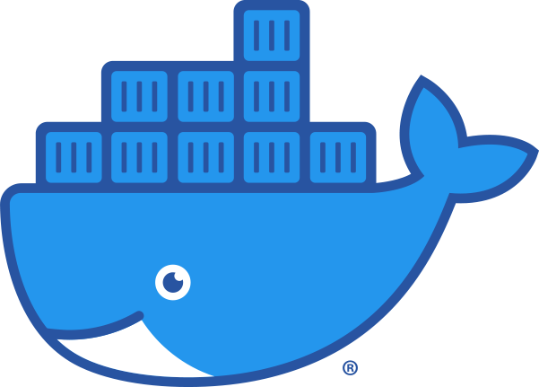

# Booking Cafe - Система бронирования мест в кафе

[](https://python.org)
[](https://fastapi.tiangolo.com)
[](https://postgresql.org)
[](https://rabbitmq.com)
[](https://celeryproject.org)
[](https://flower.readthedocs.io)
[](https://docker.com)

## Команда разработки

| Разработчик | Email | Роль | Когорта |
|-------------|-------|------|---------|
| Алексей Власов | - | Бэкенд-разработчик | #62 |
| Альберт Тимофеев | sinaotets@yandex.ru | Бэкенд-разработчик | #56+ |
| Давид Арутюнов | david.arutyuno@gmail.com | Бэкенд-разработчик | #59 |
| Денис Сергеев | - | Бэкенд-разработчик | #62+ |
| Денис Лобанов | - | Бэкенд-разработчик | #62+ |
| Евгений Димитриев | eeXaiLee@yandex.ru | Бэкенд-разработчик | #63+ |
| Илья Вилков | iliyavilkov@gmail.com | Тимлид | #62+ |
| Павел Метелев | bumble---bee@yandex.ru | Бэкенд-разработчик | #63+ |

## Описание проекта

Booking Cafe - это высокопроизводительный бэкенд-сервис для бронирования мест в кафе с поддержкой асинхронных операций, уведомлений и управления бронированиями в реальном времени.

## Технологический стек

| Компонент | Технологии |
|-----------|------------|
| **Язык** | Python 3.12.7 |
| **Веб-фреймворк** | FastAPI 0.115.0, Uvicorn 0.32.0 |
| **База данных** | PostgreSQL 15+, SQLAlchemy 2.0.36, AsyncPG 0.29.0, Alembic 1.13.1 |
| **Аутентификация** | JWT (python-jose[cryptography]), bcrypt (passlib) |
| **Валидация** | Pydantic 2.12.5, Pydantic-settings 2.13.1 |
| **Асинхронная обработка** | Celery 5.6.2, RabbitMQ 3.13+, aio-pika 9.5.0 |
| **Работа с файлами** | Pillow 12.1.1, aiofiles 25.1.0 |
| **Инструменты** | Ruff 0.11.11, pre-commit 4.2.0, Loguru 0.7.2 |
| **Тестирование** | Pytest 8.3.4, pytest-asyncio 0.25.2, HTTPX 0.27.2 |
| **Мониторинг** | Flower 2.0.1 |
| **Архитектура** | Dependency-injector 4.48.3 |

## Структура проекта

```bash
booking-cafe-backend/
├── src/
│   ├── app/
│   │   ├── api/                     # API эндпоинты и зависимости
│   │   │   ├── endpoints/           # Модули эндпоинтов
│   │   │   │   ├── action.py        # Акции
│   │   │   │   ├── auth.py          # Аутентификация
│   │   │   │   ├── booking.py       # Бронирования
│   │   │   │   ├── cafe.py          # Кафе
│   │   │   │   ├── dish.py          # Блюда
│   │   │   │   ├── media.py         # Медиафайлы
│   │   │   │   ├── table.py         # Столы
│   │   │   │   ├── time_slot.py     # Временные слоты
│   │   │   │   └── user.py          # Пользователи
│   │   │   ├── dependencies.py      # Общие зависимости
│   │   │   └── routers.py           # Главный роутер
│   │   ├── core/                    # Ядро приложения
│   │   │   ├── config.py            # Настройки
│   │   │   ├── constants.py         # Константы
│   │   │   ├── db.py                # Подключение к БД
│   │   │   ├── init_db.py           # Инициализация БД
│   │   │   ├── jwt_security.py      # JWT токены
│   │   │   └── logging.py           # Логирование
│   │   ├── crud/                    # CRUD операции
│   │   │   ├── action.py            # CRUD акций
│   │   │   ├── base.py              # Базовый CRUD класс
│   │   │   ├── booking.py           # CRUD бронирований
│   │   │   ├── cafe.py              # CRUD кафе
│   │   │   ├── dish.py              # CRUD блюд
│   │   │   ├── table.py             # CRUD столов
│   │   │   ├── time_slot.py         # CRUD временных слотов
│   │   │   └── user.py              # CRUD пользователей
│   │   ├── models/                  # SQLAlchemy модели
│   │   │   ├── action.py            # Модель акции
│   │   │   ├── booking.py           # Модель бронирования
│   │   │   ├── cafe.py              # Модель кафе
│   │   │   ├── dish.py              # Модель блюда
│   │   │   ├── outbox_event.py      # Модель outbox событий
│   │   │   ├── processed_event.py   # Модель обработанных событий
│   │   │   ├── refresh_token.py     # Модель refresh токенов
│   │   │   ├── table.py             # Модель стола
│   │   │   ├── time_slot.py         # Модель временного слота
│   │   │   └── user.py              # Модель пользователя
│   │   ├── rabbit/                  # RabbitMQ интеграция
│   │   │   ├── connection.py        # Управление подключением
│   │   │   ├── consumer.py          # Потребитель сообщений
│   │   │   └── producer.py          # Производитель сообщений
│   │   ├── schemas/                 # Pydantic схемы
│   │   │   ├── action.py            # Схемы акций
│   │   │   ├── booking.py           # Схемы бронирований
│   │   │   ├── cafe.py              # Схемы кафе
│   │   │   ├── dish.py              # Схемы блюд
│   │   │   ├── errors.py            # Схемы ошибок
│   │   │   ├── events.py            # Схемы событий
│   │   │   ├── media.py             # Схемы медиа
│   │   │   ├── table.py             # Схемы столов
│   │   │   ├── time_slot.py         # Схемы временных слотов
│   │   │   ├── types.py             # Кастомные типы с валидацией
│   │   │   └── user.py              # Схемы пользователей
│   │   ├── services/                # Бизнес-логика
│   │   │   ├── auth.py              # Сервис аутентификации
│   │   │   ├── booking.py           # Сервис бронирований
│   │   │   ├── cafe.py              # Сервис кафе
│   │   │   └── table.py             # Сервис столов
│   │   ├── utils/                   # Утилиты
│   │   │   └── media.py             # Работа с медиафайлами
│   │   └── validators/              # Валидаторы
│   │       ├── action.py            # Валидатор акций
│   │       ├── cafe.py              # Валидатор кафе
│   │       ├── dish.py              # Валидатор блюд
│   │       ├── media.py             # Валидатор медиа
│   │       ├── orm_models_validator.py # ORM валидатор
│   │       ├── table.py             # Валидатор столов
│   │       └── time_slot.py         # Валидатор временных слотов
│   ├── celery_app/                  # Celery приложение
│   │   ├── tasks/                   # Celery задачи
│   │   │   ├── booking_notifications.py # Уведомления о бронированиях
│   │   │   ├── consumer.py          # Потребитель задач
│   │   │   ├── health.py            # Healthcheck задачи
│   │   │   └── outbox.py            # Outbox задачи
│   │   ├── utils/                   # Утилиты Celery
│   │   │   ├── celery_db.py         # Работа с БД
│   │   │   └── email_templates.py   # Шаблоны писем
│   │   ├── config.py                # Конфигурация Celery
│   │   └── worker.py                # Точка входа Celery worker
│   ├── containers.py                # DI-контейнер
│   └── main.py                      # Точка входа FastAPI
│
├── infra/                           # Docker и конфигурация
│   ├── docker-compose.yml           # Docker Compose
│   ├── .env.example                 # Пример переменных окружения
│   ├── postgres.conf                # Настройки PostgreSQL
│   └── rabbitmq.conf                # Настройки RabbitMQ
│
├── alembic/                         # Миграции БД
├── tests/                           # Тесты
├── logs/                            # Логи приложения
│   └── app.log
├── Dockerfile                       # Docker образ
├── requirements.txt                 # Основные зависимости
└── requirements_develop.txt         # Зависимости для разработки
```

<br>

# Быстрый старт

## <td align="center"><a href=""><br /><b>Docker (рекомендуемый способ)</b></a></td>

```bash
# Клонирование репозитория
git clone <your-repo-url>
cd booking-cafe-backend

# Копирование переменных окружения
cp infra/.env.example infra/.env

# Запуск контейнеров
docker compose --env-file infra/.env -f infra/docker-compose.yml up --build -d
```

Проверка статуса
```bash
docker compose --env-file infra/.env -f infra/docker-compose.yml ps
```

## Локальный запуск (без Docker)

1. Скопируйте .env.example в файл .env в директории infra:
```bash
cp infra/.env.example infra/.env
```

2. Из папки /infra запустите контейнер с базой данных:
```bash
docker compose up db
```

3. В корне проекта примените миграции Alembic:
```bash
alembic upgrade head
```

4. В отдельном терминале перейдите в папку src и запустите сервер:
```bash
cd src
uvicorn main:app --host 0.0.0.0 --port 8000 --reload
```

5. Перейдите по адресу: http://0.0.0.0:8000/docs

<br>

# Основные URL сервисов

| Сервис | URL|
|-------------|-------------|
| Swagger UI (интерактивная API документация) | http://localhost:8000/docs |
| ReDoc | http://localhost:8000/redoc |
|OpenAPI спецификация|http://localhost:8000/openapi.json|
| Flower (мониторинг Celery задач) | http://localhost:5555 |
| RabbitMQ Management | http://localhost:15672 |
| smtp4dev UI | http://localhost:5001 |
|||


<br>

# Модели данных

Проект включает следующие основные сущности:

  * Пользователи - система ролей и аутентификация

  * Кафе - информация о заведениях

  * Столы - управление столиками в кафе

  * Временные слоты - доступные интервалы времени

  * Блюда - меню кафе

  * Акции - специальные предложения

  * Бронирования - основная бизнес-логика

  * Медиа - управление изображениями

<br>

# Система аутентификации

Используется OAuth2 с password flow:

  * JWT токены для авторизации

  * Ролевая модель доступа (Администратор, Менеджер, Пользователь)

  * Защищенные эндпоинты с проверкой прав доступа

## Получение токена

```bash
curl -X POST "http://localhost:8000/auth/login" \
  -H "Content-Type: application/x-www-form-urlencoded" \
  -d "login=user@example.com&password=your_password"
  ```

## Права доступа

| Роль | Пользователи | Кафе | Столы | Слоты | Блюда | Акции | Бронирования | Медиа |
|-------------|-------------|-------------|-------------|-------------|-------------|-------------|-------------|-------------|
|Администратор|CRUD+|CRUD|CRUD|CRUD|CRUD|CRUD|CRUD|CR|
|Менеджер|CRU-|RUD*|RUD*|RUD*|RUD*|RUD*|RUD*|CR*|
|Пользователь|R|R|R|R|R|R|CRUD°|-|
|Неавторизованный|C|-|-|-|-|-|-|-|

Примечания:

    * - только для связанных кафе

    ° - только собственные бронирования

    + - полный доступ ко всем записям

    - - доступ запрещен

<br>

# Асинхронная обработка

Используется схема: Outbox → RabbitMQ → Consumer → Celery task

1. Service-слой пишет бизнес-изменение и outbox-событие в одной транзакции

2. Задача publish_pending_outbox_events публикует события в domain.events

3. Задача consume_domain_events маршрутизирует события в Celery-задачи

4. Идемпотентность обеспечивается таблицей processed_event

<br>


# Сквозная трассировка


Для observability добавлен correlation id по всей цепочке обработки:

```bash
curl -H "X-Request-ID: demo-trace-001" \
  -H "Authorization: Bearer <token>" \
  -H "Content-Type: application/json" \
  -d '{"cafe_id":1,"booking_date":"2026-03-27","guest_number":2,"tables_id":[1],"slots_id":[1]}' \
  http://localhost:8000/booking/
```

<br>


# Примеры запросов

Создание бронирования

```bash
curl -X POST "http://localhost:8000/booking/" \
  -H "Authorization: Bearer <your_token>" \
  -H "Content-Type: application/json" \
  -d '{
    "cafe_id": 1,
    "tables_id": [1, 2],
    "slots_id": [1],
    "guest_number": 4,
    "note": "Столик у окна",
    "status": 0,
    "booking_date": "2025-04-15"
  }'
```

Получение информации о кафе

```bash
curl -X GET "http://localhost:8000/cafes/1" \
  -H "Authorization: Bearer <your_token>"
```

Создание акции (только для администраторов и менеджеров)

```bash
curl -X POST "http://localhost:8000/actions/" \
  -H "Authorization: Bearer <your_token>" \
  -H "Content-Type: application/json" \
  -d '{
    "description": "Счастливые часы! Скидка 20% на всё меню",
    "photo_id": "3fa85f64-5717-4562-b3fc-2c963f66afa6",
    "cafes_id": [1, 2, 3]
  }'
  ```

<br>


# Разработка

### Установка зависимостей

```bash
pip install -r requirements.txt
```

### Запуск тестов

```bash
pytest tests/
```

### Проверка стиля кода
```bash
ruff check
ruff check --fix  # автоисправления
```
### Pre-commit hooks
```bash
pre-commit install
```

<br>

# 🌐 Production Deploy

Production окружение читает значения только из серверного infra/.env. GitHub Actions не перерисовывает production compose значениями из secrets перед копированием на сервер.

<br>

# 🤝 Вклад в проект

Приветствуются pull request'ы. Для серьезных изменений, пожалуйста, откройте issue для обсуждения.

    Форкните репозиторий

    Создайте feature branch: git checkout -b feature/amazing-feature

    Закоммитьте изменения: git commit -m 'Add amazing feature'

    Запушьте branch: git push origin feature/amazing-feature

    Откройте Pull Request

# 📜 Лицензия

MIT License

Copyright (c) 2026 Команда разработки Booking Cafe

Permission is hereby granted, free of charge, to any person obtaining a copy
of this software and associated documentation files (the "Software"), to deal
in the Software without restriction, including without limitation the rights
to use, copy, modify, merge, publish, distribute, sublicense, and/or sell
copies of the Software, and to permit persons to whom the Software is
furnished to do so, subject to the following conditions:

The above copyright notice and this permission notice shall be included in all
copies or substantial portions of the Software.

THE SOFTWARE IS PROVIDED "AS IS", WITHOUT WARRANTY OF ANY KIND, EXPRESS OR
IMPLIED, INCLUDING BUT NOT LIMITED TO THE WARRANTIES OF MERCHANTABILITY,
FITNESS FOR A PARTICULAR PURPOSE AND NONINFRINGEMENT. IN NO EVENT SHALL THE
AUTHORS OR COPYRIGHT HOLDERS BE LIABLE FOR ANY CLAIM, DAMAGES OR OTHER
LIABILITY, WHETHER IN AN ACTION OF CONTRACT, TORT OR OTHERWISE, ARISING FROM,
OUT OF OR IN CONNECTION WITH THE SOFTWARE OR THE USE OR OTHER DEALINGS IN THE
SOFTWARE.

# 📞 Контакты

    Репозиторий проекта: https://github.com/Yandex-Practicum-Students/62_63_booking_seats_team_5

    Багрепорты: https://github.com/Yandex-Practicum-Students/62_63_booking_seats_team_5/issues

Разработано в рамках учебного проекта Яндекс.Практикума 🎓
